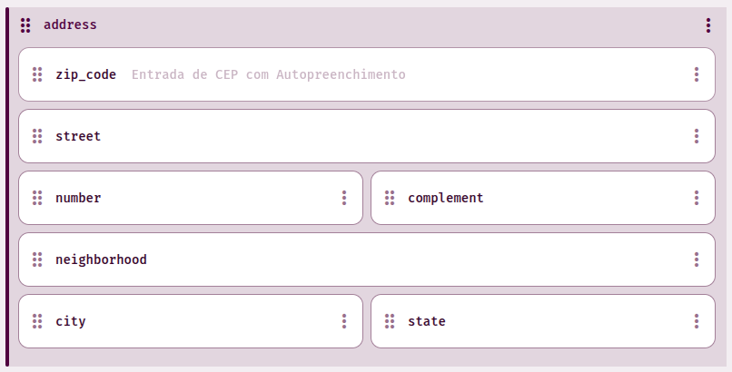
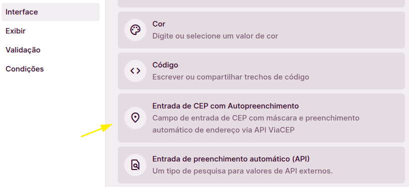
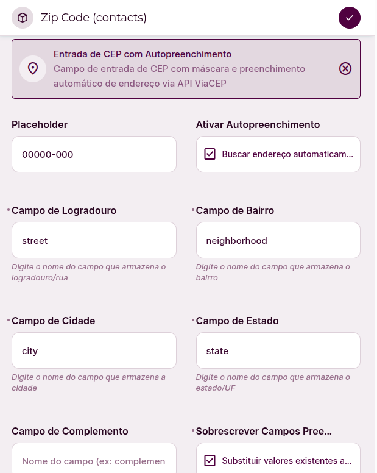

# CEP Autofill for Directus

Automatically populate address fields in Directus using Brazilian postal codes (CEP). This extension integrates with the free [ViaCEP API](https://viacep.com.br) to fetch street, neighborhood, city, and state information when users enter a CEP.

> **Note:** According to Directus CRM limitations, it's impossible to provide translations for the extension. For this reason, although this documentation is in English for marketplace standards, all the interface and validations are in Portuguese (BR).

## Features

- Brazilian CEP input with automatic formatting (xxxxx-xxx)
- Real-time address lookup via ViaCEP API
- Configurable field mapping for flexible collection structures
- Server-side validation (8-digit format)
- Visual feedback with success/error indicators
- Formatted display component for read-only views

## Installation

### Via Directus Marketplace (Recommended)

1. Navigate to your Directus project
2. Go to **Settings** → **Extensions**
3. Search for "**CEP Autofill**"
4. Click **Install**

### Via npm

```bash
npm install @ribertec/directus-extension-cep-autofill
```

Then restart your Directus instance.

## Configuration

1. **Create or edit a collection** with address fields (street, neighborhood, city, state)



2. **Add a CEP field:**
   - Type: `String`
   - Interface: Select **"Entrada de CEP com Autopreenchimento"**



3. **Configure field mapping** in the interface options:
   - **Campo de Logradouro**: Enter the name of your street field (e.g., `street`)
   - **Campo de Bairro**: Enter the name of your neighborhood field (e.g., `neighborhood`)
   - **Campo de Cidade**: Enter the name of your city field (e.g., `city`)
   - **Campo de Estado**: Enter the name of your state/UF field (e.g., `state`)
   - **Campo de Complemento**: Enter complement field name



4. **Optional settings:**
   - **Ativar Autopreenchimento**: Toggle automatic address lookup (default: on)
   - **Sobrescrever Campos Preenchidos**: Replace existing values when fetching (default: off)

## Usage

1. Enter a Brazilian CEP in the CEP field
2. When you type the 8th digit, the extension automatically searches for the address
3. If found, address fields are populated automatically
4. A green checkmark indicates success; red icon indicates CEP not found
5. The CEP is stored as 8 digits in the database, displayed formatted in layouts

### Example

**Input:** `01310100` or `01310-100`

**Result:** Automatically fills:

- Street: Avenida Paulista
- City: São Paulo
- State: SP


## API & Data Source

This extension uses the free [ViaCEP API](https://viacep.com.br/) - no API key required. The service is maintained by the Brazilian government and provides accurate postal code data for Brazil.

## Requirements

- Directus 10.10.0 or higher

## License

MIT License - see [LICENSE](LICENSE) file for details

---
